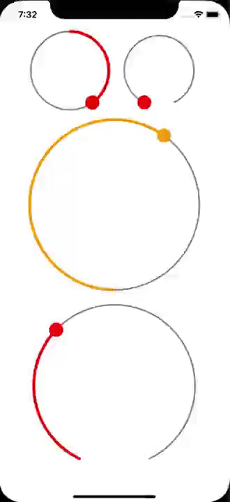

# CircularSlider.Maui


Circle Slider Component for .NET MAUI. Forked and ported from [CC.CircularSlider.Forms](https://github.com/codechem/CC.CircularSlider.Forms) to .NET MAUI.
## Preview



## Setup

Supported platforms are currently iOS and Android.

```
Install-Package CircularSlider.Maui
```

## Usage

```xml
<?xml version="1.0" encoding="utf-8" ?>
<ContentPage
    x:Class="CircularSliderSample.MainPage"
    xmlns="http://xamarin.com/schemas/2014/forms"
    xmlns:x="http://schemas.microsoft.com/winfx/2009/xaml"
    xmlns:circularSlider="clr-namespace:CircularSlider.Maui;assembly=CircularSlider.Maui">

    <StackLayout>
        <circularSlider:CircularSlider
            Maximum="100"
            Minimum="0"
            PaddingAround="10"
            Start="90"
            Value="50" />
    </StackLayout>
</ContentPage>
```

And in the C#:

```c#
using System;
using Xamarin.Forms;

namespace CircularSliderSample
{
    public partial class MainPage : ContentPage
    {
        public MainPage()
        {
            InitializeComponent();
        }

        private void CircularSlider_OnValueChanged(object sender, ValueChangedEventArgs e)
        {
            Console.WriteLine(e.NewValue);
        }
    }
}
```

This should give you a page with a large slider embedded.

## Bindable Properties/Events

| Type       | Property                  | Description                                                                                                                         | Default Value              |
|------------|---------------------------|-------------------------------------------------------------------------------------------------------------------------------------|----------------------------|
| Property   | Minimum                   | The minimum value of the slider.                                                                                                    | `0`                        |
| Property   | Maximum                   | The maximum value of the slider.                                                                                                    | `1`                        |
| Property   | TrackColor                | The color of the background track (the back, unfilled part of the slider)                                                           | `Color.Gray`               |
| Property   | TrackProgressColor        | The color of the progress track (the front, filled part of the slider)                                                              | [`Application.AccentColor`](https://learn.microsoft.com/en-us/dotnet/api/microsoft.maui.controls.application.accentcolor) |
| Property   | KnobColor                 | The color of the knob/handle of the slider                                                                                          | [`Application.AccentColor`](https://learn.microsoft.com/en-us/dotnet/api/microsoft.maui.controls.application.accentcolor) |
| Property   | TrackWidth                | The width of the background track (the back, unfilled part of the slider)                                                           | `20`                       |
| Property   | TrackProgressWidth        | The width of the progress track (the front, filled part of the slider)                                                              | `10`                       |
| Property   | KnobWidth                 | The width of the knob/handle of the slider                                                                                          | `5`                        |
| Property   | Value                     | The `Value` of the slider.                                                                                                          | `0`                        |
| Property   | Start                     | The `Start` of the slider in degrees (0 degrees is on the right side of the circle, and the angles are clockwise).                  | `90`                       |
| Property   | Arc                       | How many degrees the slider should take up from the start (Max 360 - a full circle)                                                 | `360`                      |
| Property   | PaddingAround             | Spacing from the edges of the control.                                                                                              | `25`                       |
| Event      | ValueChanged              | Event fired when the value changes due to user interaction - same event args as the regular Xamarin.Forms Slider control.           |                            |

## Dependencies

- SkiaSharp.Views.Maui.Controls